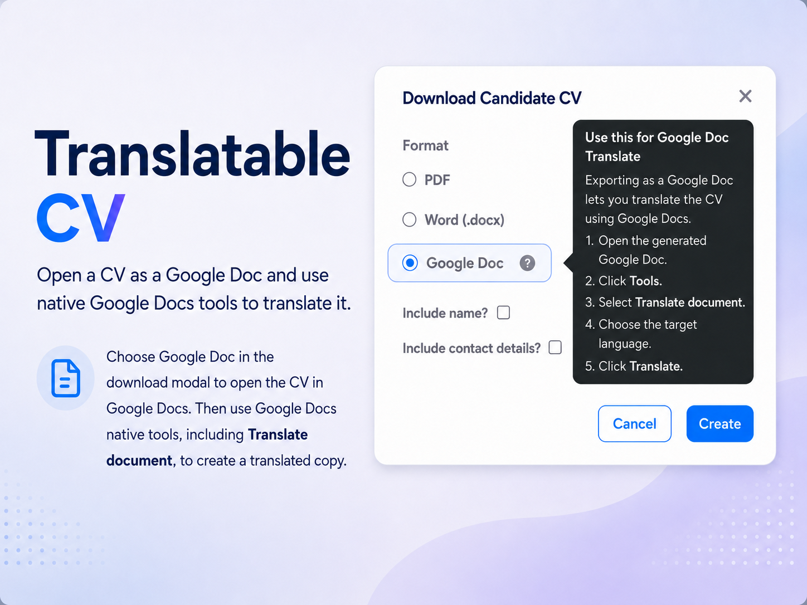
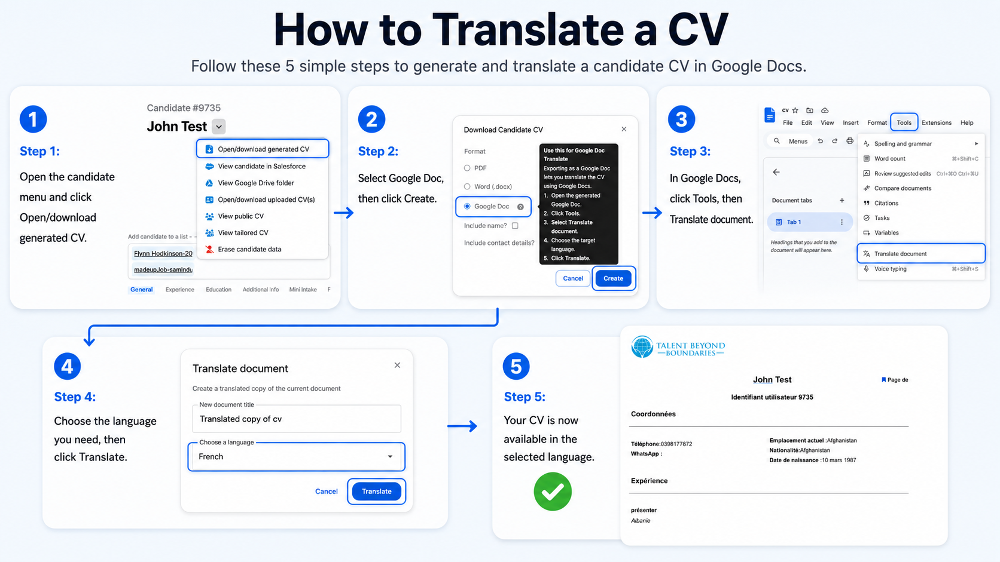

# Translatable cv

Admins can now choose the format when generating a candidate CV from the candidate profile.

---

### Choose the right format for the task

Generated CVs can be downloaded as a PDF or Word document, or created as a Google Doc.

PDF is useful when the CV is ready to share. Word (.docx) is useful when teams need a downloadable editable file. Google Doc export is useful when teams want to edit or translate the CV in Google Docs.

---

### Easier editing and translation

  

The Google Doc option opens the generated CV in Google Docs, where users can use built-in Google Docs tools such as Translate document.

This supports teams who need to prepare candidate CVs in another language while keeping the generated CV workflow inside Talent Catalog.

  

---

### Candidate details still controlled

The existing include-name and include-contact-details options remain available when generating a CV.

This means teams can still choose whether the generated CV should include identifying or contact information, while also choosing the export format that best fits the next step.
