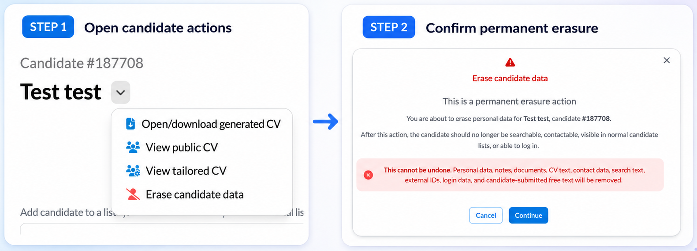

# Full candidate deletion

Talent Catalog now supports full candidate deletion for cases where a candidate requests that their data is removed.

---

### Supporting candidate privacy rights

Candidates may request that all of their data is removed from Talent Catalog.

This release improves support for this workflow and helps Talent Catalog meet stronger privacy and data protection requirements.

---

### Handling connected candidate data safely

Candidate data can appear in connected structures such as lists, opportunities, notes, documents, and profile text.

The deletion workflow is designed to remove candidate data while avoiding broken database relationships or unsafe admin flows.

---

### Extra confirmation for destructive actions

Because full deletion is destructive and irreversible, the implementation requires stronger confirmation before the process can continue.

  

