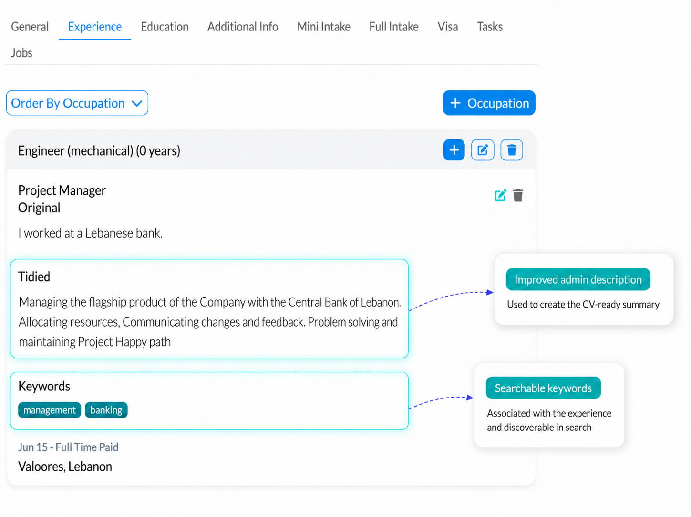
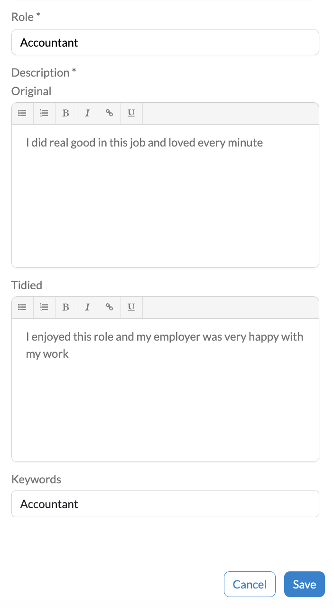
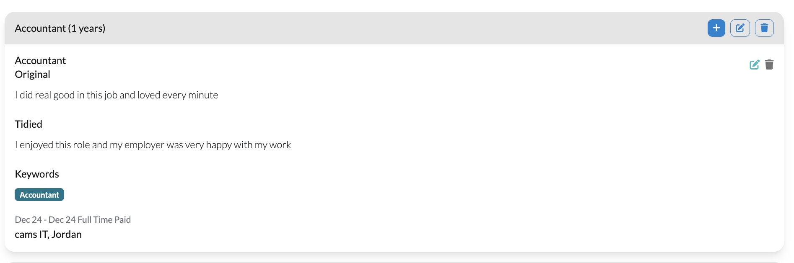

# Separate Candidate and Admin Job Experience Text

This release improves how Talent Catalog handles job experience text when partners or admins enhance candidate profiles.

Previously, improving a candidate's job experience description could risk replacing the candidate's original wording. This update allows the candidate-entered text and the admin-enhanced text to be kept separately.

---

### Preserving the candidate's original words

When partners or admins improve candidate profiles, it is important that the candidate's original information is not lost.

Candidate-entered text is now preserved separately from admin-enhanced text. The candidate will continue to see the original job experience description they entered when they log in to their account.

This helps protect the candidate's own voice and avoids confusion about which information came directly from the candidate.

Candidates continue to see their original job experience text. Tidied text and keywords are admin-only fields, so they can be used to improve profile quality without changing the candidate-facing version of the experience.

---

### Supporting better profile improvements

Admins and partners can now enhance job experience text with more confidence.

They can improve clarity, structure, or presentation without overwriting the candidate's original description. This supports better-quality candidate profiles while keeping the original candidate-entered data available for reference.

The tidied description can capture an improved version of the experience, for example after a conversation with the candidate. Keywords can also be added to record important terms associated with the role, making relevant experience easier to find.

When searching, Talent Catalog scans the original text, tidied text, and keywords. When creating a CV, the tidied text is used if present; otherwise, the original candidate-entered text is used.

  

---

### Example from the screenshot

  

The screenshot shows the edit view for an Accountant job experience. The candidate's original description is kept in the Original field, while the admin-enhanced version is managed separately in the Tidied field.

  

After saving, both versions are visible in the job experience card. This makes it clear what the candidate originally entered and what has been tidied for profile presentation.
