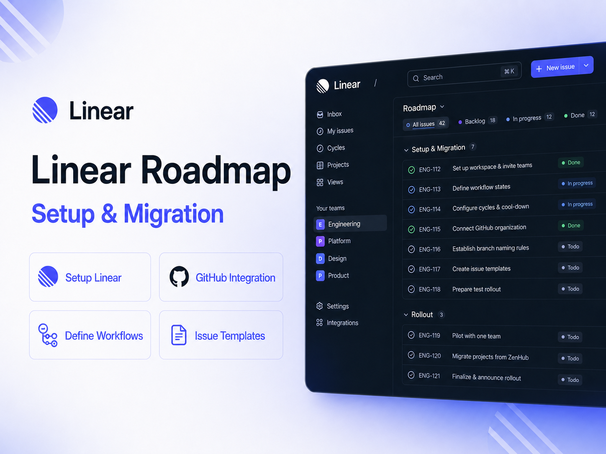

# [Linear](https://linear.app/)  Product Roadmap

The engineering team has moved workflows from ZenHub to [Linear](https://linear.app/) — the industry standard for lightning-fast issue tracking, clear planning, and powerful GitHub integration.

---

### Linear workspace setup

The Linear workspace has been created as the new home for roadmap planning, issue tracking, and delivery coordination.

Linear is widely used by modern product and engineering teams because it supports fast issue tracking, clear planning, and strong GitHub-based development workflows.

Initial setup focused on inviting admin users first, configuring teams, and preparing the workspace before wider rollout.

---

### Workflow and planning configuration

Linear has been configured to support the team's agreed delivery workflow, including workflow states, cycle cadence, and cool-down periods.

The setup also includes GitHub integration, branch name templates, and a standard issue-to-branch-to-PR flow so engineering work can move cleanly from planning through review and merge.

---

### Templates and rollout

Standard issue creation templates have been set up in Linear and replicated in GitHub to keep issue capture consistent across tools.

The rollout includes testing the full issue, branch, PR, and merge cycle with admins before broader team adoption.

  

