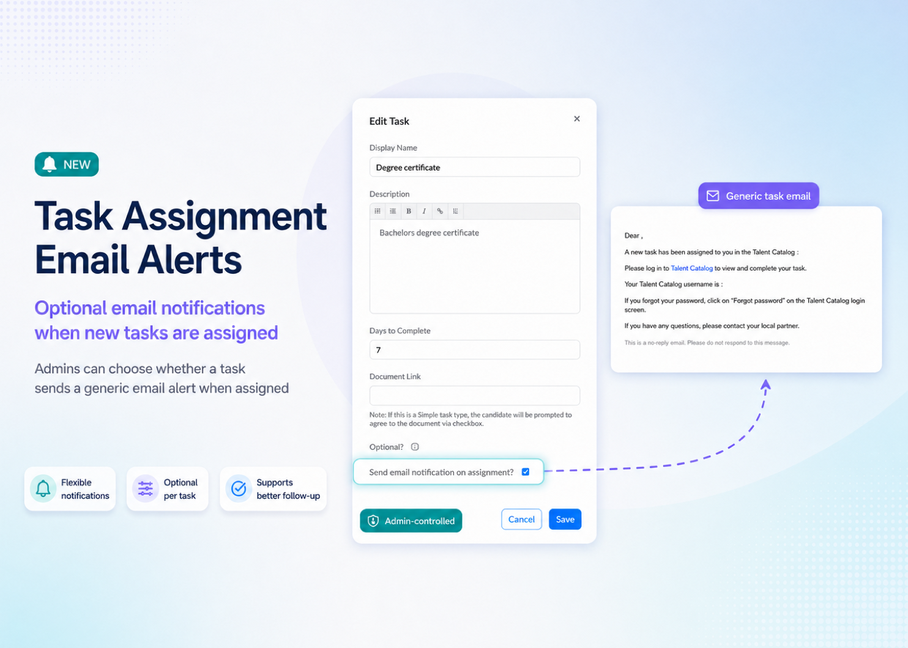

# Task email alerts

Talent Catalog now supports generic email alerts when Tasks are assigned.

---

### Helping users know when action is needed

When a Task is assigned, users can now receive an email notification.

This helps reduce the need to manually check for new Tasks and makes important actions more visible.

---

### Configurable task notifications

Admins can configure whether a Task should notify candidates when assigned.

This gives teams more control over when email alerts are useful and helps avoid unnecessary notification noise.

  

---
