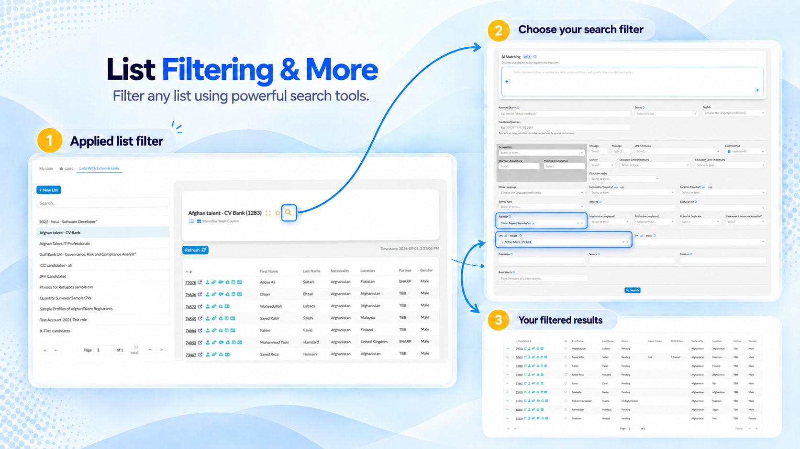
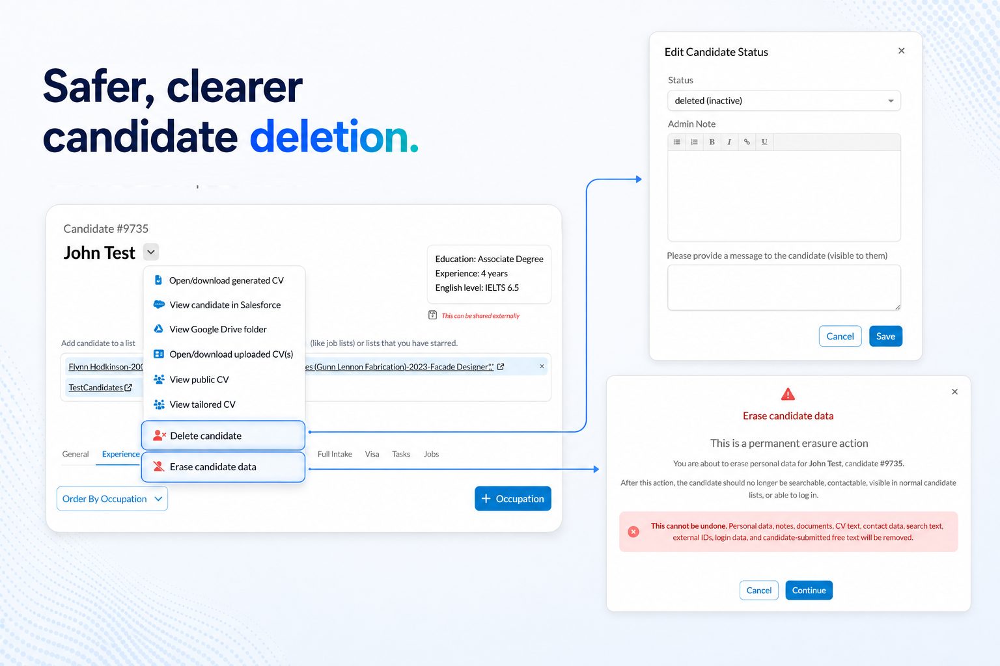
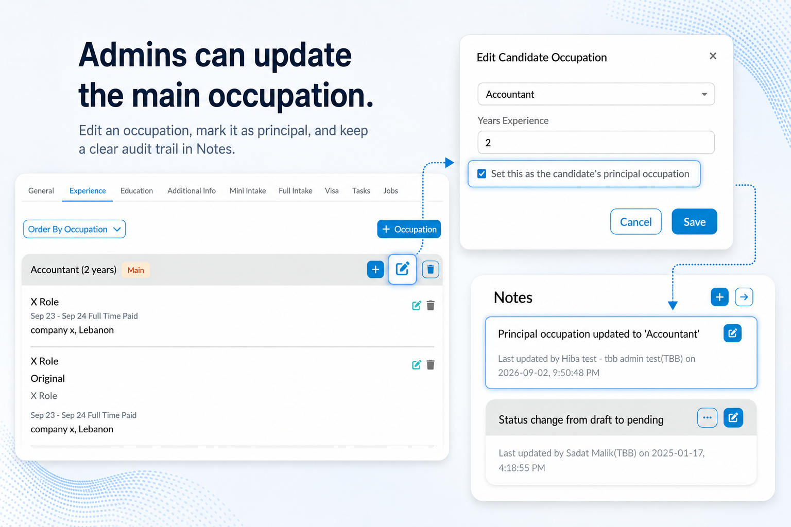

# Full List Filtering & More

    

This release bundles three practical improvements: lists that can be filtered instead of scrolled 
through by hand, clearer and safer controls around deleting a candidate's record, and a principal 
occupation field on its way to giving job matching a sharper read on what a candidate is really 
looking for.

## 🔎 Filter Any  List

Submission lists tied to a hiring commitment can run to hundreds of candidates — one recent cohort 
case reached 700, against a commitment of 20 hires. Scrolling through a list that size by hand
to find the right candidates has never been realistic, and a way to filter within a list was
one of the most requested fixes from the users who manage these lists day to day.

Every list now has a search icon next to its name. Clicking it opens the standard search
screen, pre-scoped to just that list's candidates — and from there, the full range of existing
search filters is available: keyword search, status, partner, and more, all narrowing down the
same list rather than starting a fresh search across the whole database. For job-based lists,
this pairs directly with the new <a href="../v260/ai_job_matching">AI-powered requirements
matching</a> landing this release.

Job-stage and IELTS-score filters weren't part of this pass — see What's Next below.

## 🗑️ Safer, Clearer Candidate Deletion

This builds on <a href="../v251/full_candidate_deletion">full candidate deletion</a> from
2.5.1, tightening permissions and cleaning up a handful of rough edges found since.

    

**Erase Candidate Data** is now correctly restricted to system administrators only. Other
admins who can edit a candidate instead see a new **Delete candidate** action, which simply
marks the candidate's status as deleted — the same reversible, non-destructive option that has
always been the preferred first step. It opens through the familiar status-edit screen, which
has also been fixed to reliably show a candidate's current status rather than sometimes
appearing blank.

Erase Candidate Data also now stays available once a candidate's status is already deleted, so
system admins aren't blocked from following through to full erasure. In search, deleted
candidates no longer appear when searching by name — previously they could show up in results
but couldn't be opened, which was more confusing than helpful. And searching for a candidate
number that doesn't exist, or one that belongs to a candidate whose data has already been fully
erased, now shows a clear explanation instead of a generic access-denied message.

## ⭐ Principal Occupation

Candidates often have more than one occupation on file — years-old experience alongside
what they're actually pursuing now. Counting every occupation equally can blur the picture:
someone's brief stint as a barista ends up counted the same as eight years as a software
developer. This release lets a candidate mark one occupation as their principal one, so
there's a clear, single answer to "what is this person actually looking for?"

    

A candidate with multiple occupations on file selects one as their main occupation; selecting a
different one replaces the previous choice. Once a candidate has any occupations recorded,
choosing a principal one is required — the choice can be updated at any time.

    

The principal occupation is shown clearly on a candidate's profile in the admin portal, so
staff no longer have to guess which of several occupations actually matters most. Admins can
change which occupation is marked as principal — though not clear it back to none — and
doing so leaves a note on the candidate's record, so there's a visible trail of who changed
it and when.

## 🚀 What's Next

- Job-stage and IELTS-score filters for submission lists — the two most-requested filter
  fields not covered in this pass.
- Continued tightening of candidate deletion and search based on real admin usage.
- A clearer principal occupation is expected to feed into better job-matching quality over
  time, alongside the AI job matching work landing this release.
