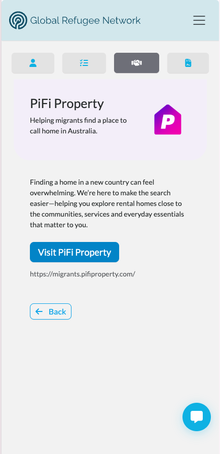
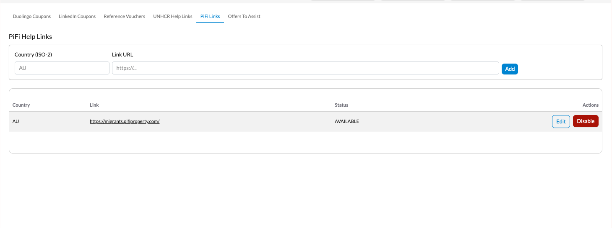

# PiFi Property: Helping Migrants Find a Home

    

The <a href="../v240/casi_framework">Candidate Assistance Services Interface (CASI)</a> gets
a new service on GRN: a signpost to **PiFi Property**, helping eligible candidates explore
rental homes close to the communities, services, and everyday essentials that matter to them
in their new country.

## 🏠 A New Card in the Services Tab

Eligible GRN registrants see a **PiFi Property** card — *"Helping migrants find a place to
call home in Australia"* — sitting alongside the other CASI services like UNHCR Verify+.
Selecting it shows a short description of the service and a single button through to PiFi's
site.

    

This is signposting only: clicking through takes the candidate to PiFi's own property search
as an anonymous visitor. There's no login hand-off, no account linking, and no candidate data
shared with PiFi in this phase.

## 🌍 The Right Country, Automatically

A candidate is shown a PiFi link if one has been configured for a country relevant to them.
Relevance is checked in order — the country they're relocating to, then any country where
they have a job offer in progress, then their current country — and the first match with a
configured link wins. Today that's just Australia, where PiFi already operates.

## ⚙️ Built on the UNHCR Help Playbook

PiFi is modelled directly on the existing UNHCR Help signposting service, reusing the same
underlying CASI mechanism. The admin-portal screen for managing per-country help links has
been extended to cover both services side by side, so adding PiFi coverage for a new country
is the same admin action as adding a UNHCR Help link.

    

## 🚀 What's Next

- **More countries:** as PiFi expands its property search beyond Australia, new countries
  light up for candidates automatically — no code changes required, just a new admin link.
- **Beyond signposting:** this phase is referral-only. A later phase is expected to add a
  federated, authenticated hand-off between Talent Catalog and PiFi.
