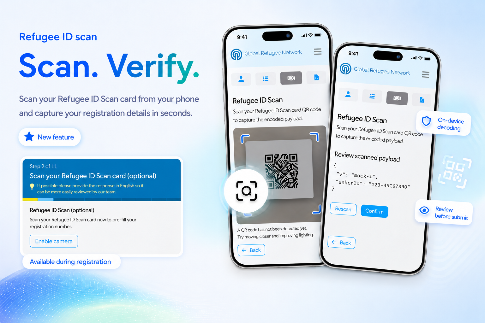
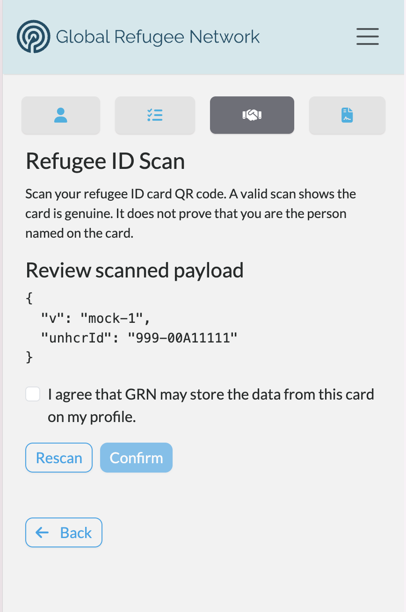
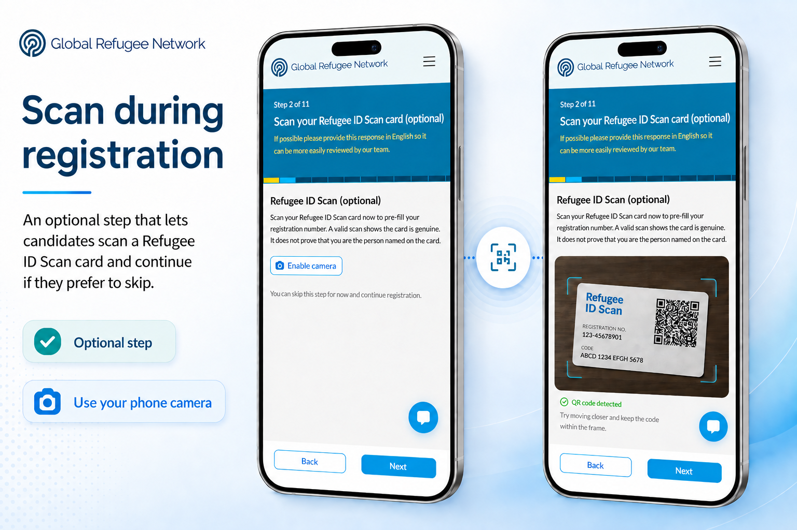
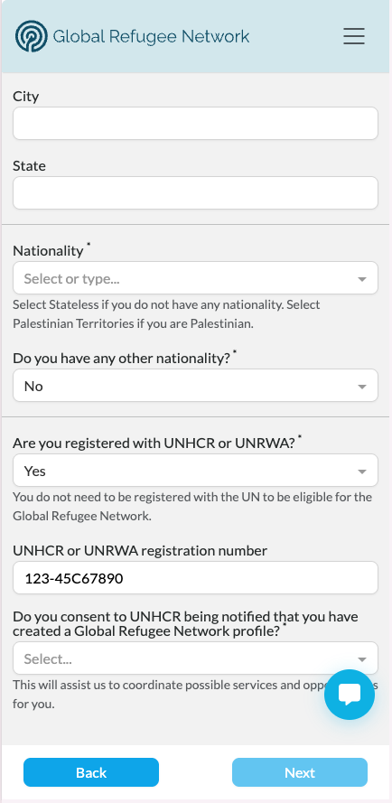
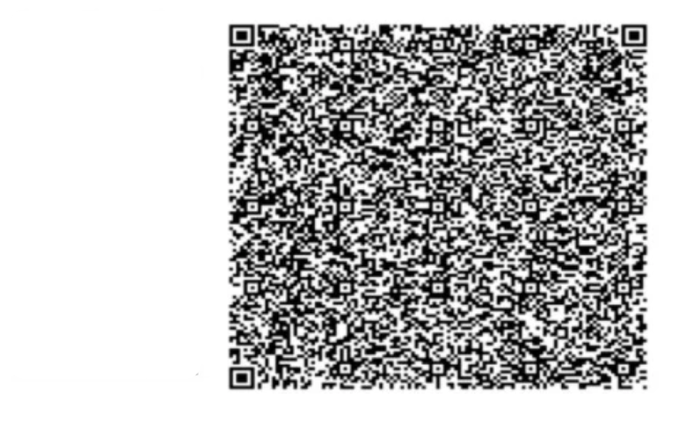
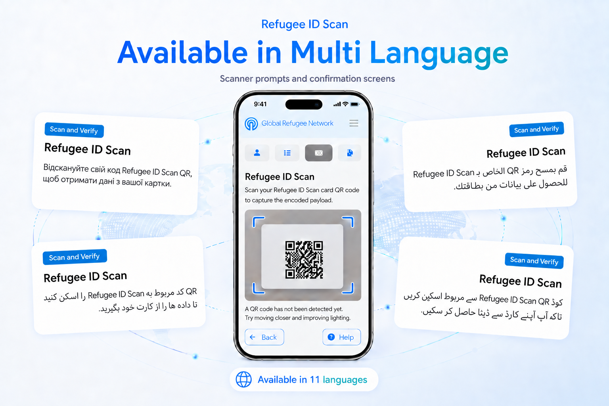

# Refugee ID Card Scanning: Verify Your Registration

    

Refugees issued an ID card have their registration number encoded in a QR code on the card.
On GRN, candidates can now scan that code directly from their phone's camera to capture and
verify their refugee registration number and personal details — no backend account linking required, 
and nothing ever leaves the device until the candidate chooses to submit it.

## 📷 Scan From the Services Tab

A new **Refugee ID Scan** card in the Candidate Portal's Services tab lets a candidate scan their
refugee ID card QR code at any time. Selecting it opens the device's back camera; the code is
decoded on-device, and the scanned payload is shown for review before anything is submitted.

    

If the camera can't start — permission denied, or no camera on the device — the candidate
sees a clear message rather than a stuck screen. Once a scan succeeds, the camera switches
off automatically; a **Rescan** option is always available if needed.

The above screen grab is just a mocked scan, and actual QR scan decodes a candidate's personal
details, as well as their refugee registration number and a low res photo image may also be decoded
from their refugee ID card.

## 📝 Or Scan During Registration

The same scan-and-submit flow is also offered as an optional, skippable step during GRN
registration — **"Scan your refugee ID card (optional)."** A candidate who scans their card has
their refugee registration number and personal details pre-filled automatically on the following 
step; a candidate without a card handy can skip the step and continue registering.

<!-- TODO(images): The RefugeeIdCardRegistrationStep.png carries over a hint banner — "If possible
     please provide this response in English so it can be more easily reviewed by our team"
     — that's boilerplate text for a free-text question and doesn't fit a QR-scan step.
     It would be better not to display it -- needs a dev fix.  SM -->

    

The refugee registration number is captured, alongside any personal details,and it shows up, 
already filled in, on the next registration step , for candidate review:

    

## 🔍 Built for Real Refugee ID QR Codes

Genuine refugee ID cards use very high-density QR codes — like the sample below — and common 
decoding libraries struggle to read these QR codes reliably. Therefore GRN mobile scanners are 
built using decoders capable of handling that density, so a scan succeeds on the first realistic 
try.

    

## 🌐 Available in Your Language

The entire scan flow — scanner prompts, confirmation screens, success and duplicate
messaging — has been translated across all 11 languages the Candidate Portal currently supports,
including Arabic, Farsi, Pashto, and Ukrainian.

    

## ✅ Your Consent, Clearly Asked

This release also adds a consent step to the scan flow, on both the Services tab and
registration: before a card is submitted, the candidate must actively confirm they're happy
for it to be captured and stored — skipping the step means nothing is saved.

<!-- TODO(images): Grab a screenshot nce the consent PR is merged.  SM -->

## 👀 Coming Into View for Staff

Right after consent, admin-portal staff have visibility into what's been verified — showing 
the captured registration number and verification status on a candidate's profile.

<!-- TODO(images): Grab a screenshot once the admin portal PR is merged.  SM -->

## 🚀 What's Next

- **Availability:** Refugee ID card scanning is currently available on GRN only.
- **Beyond the registration number:** today's release captures and verifies the refugee registration
  number only. Parsing and storing additional fields from the card, and photo handling, are
  both still ahead.
