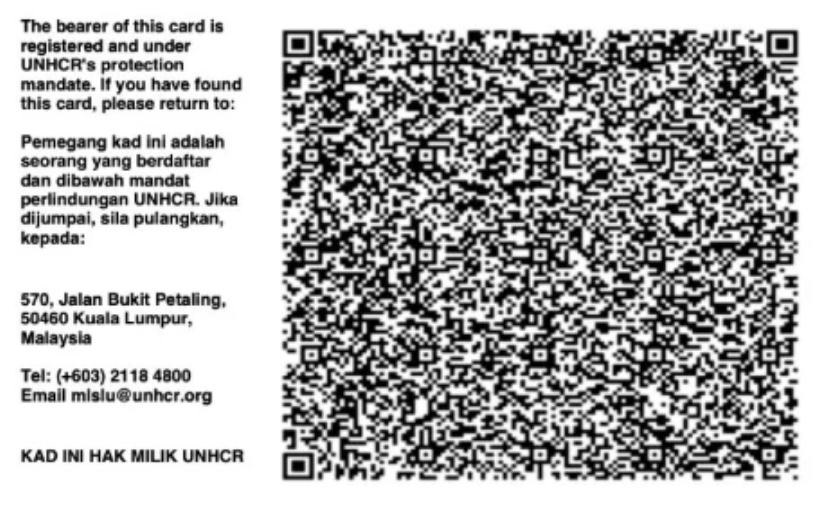

# Verify+: Scan Your UNHCR Card to Verify Your Registration

    

Refugees issued a UNHCR Verify+ card have their UNHCR ID encoded in a QR code on the card.
On GRN, candidates can now scan that code directly from their phone's camera to capture and
verify their UNHCR registration number — no backend account linking required, and nothing
ever leaves the device until the candidate chooses to submit it.

## 📷 Scan From the Services Tab

A new **Verify+** card in the Candidate Portal's Services tab lets a candidate scan their
UNHCR Verify+ QR code at any time. The scanner opens the device's back camera, decodes the
code on-device, and shows the scanned payload for review before anything is submitted.

If the camera can't start — permission denied, or no camera on the device — the candidate
sees a clear message rather than a stuck screen. Once a scan succeeds, the camera switches
off automatically; a **Rescan** option is always available if needed.

On confirm, the scan is submitted and the candidate sees one of two outcomes:

- **Verification submitted** — "Your UNHCR number was captured successfully"
- **Duplicate UNHCR number found** — "We submitted your scan, but this UNHCR number already
  exists on another active candidate" — with the option to rescan

## 📝 Or Scan During Registration

The same scan-and-submit flow is also offered as an optional, skippable step during GRN
registration — **"Scan your Verify+ card (optional)."** A candidate who scans their card has
their UNHCR registration number pre-filled automatically; a candidate without a card handy
can skip the step and continue registering. If a different UNHCR number was already on file,
the freshly scanned one takes its place.

## 🔍 Built for Real UNHCR QR Codes

Early testing surfaced a real-world snag: genuine UNHCR Verify+ cards use very high-density
QR codes that common JavaScript decoding libraries struggled to read reliably. We
investigated the failure and moved scanning onto a decoder capable of handling that density,
so a scan succeeds on the first realistic try rather than requiring several attempts.

## 🌐 Available in Your Language

The entire Verify+ flow — scanner prompts, confirmation screens, success and duplicate
messaging — has been translated across all 11 languages the Candidate Portal supports,
including Arabic, Farsi, Pashto, and Ukrainian.

## 🚀 What's Next

- **Availability:** Verify+ is currently available on GRN only.
- **Consent:** capturing explicit consent before a card is scanned and stored is planned as a
  follow-up, not yet part of this flow.
- **Beyond the UNHCR number:** today's release captures and verifies the UNHCR registration
  number only. Parsing and storing additional fields from the card, and photo handling, are
  both still ahead.
- **Admin visibility:** there's no admin-portal view of Verify+ data yet.
