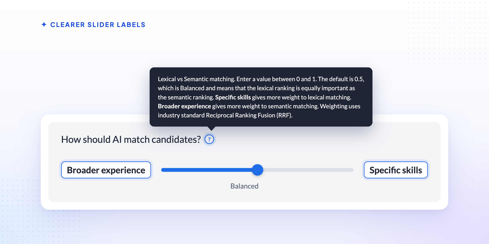
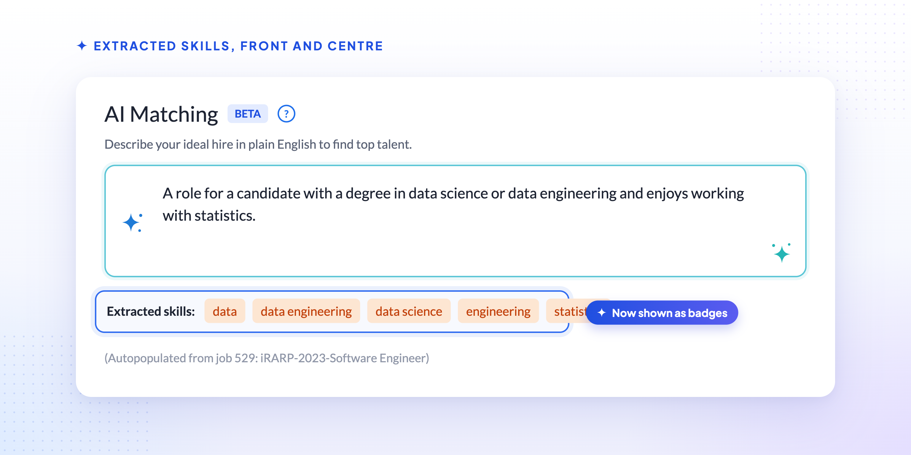
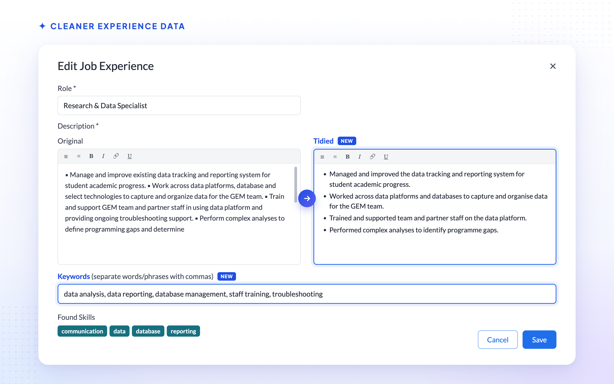

# Smarter AI Matching

    

[v2.6.0](../v260/ai_job_matching) brought the first user-facing pieces of AI matching online. This
release tunes that engine based on the first few weeks of real usage — clearer controls, extracted
skills that are easier to see, and cleaner input for the engine to work with.

## 🎚️ Clearer Slider Labels

    

The slider that balances keyword matching against semantic similarity had labels that described
the underlying technique rather than what it actually does for a search. **Exact requirements**
and **Related experience** are now **Specific skills** and **Broader experience**.

The tooltip has been rewritten to match: moving the slider towards **Specific skills** gives more
weight to matching the exact skills and keywords in your requirements text, while moving it
towards **Broader experience** gives more weight to candidates whose overall experience is a
similar fit, even if they don't use the same words. The default stays at the midpoint, weighting
the two equally.

## 🏷️ Extracted Skills, Front and Centre

    

Skills extracted from your AI match requirements text now appear as a row of badges, rather than a
plain line of comma-separated text, making it easier to see at a glance exactly which skills the
engine has picked out. Those same extracted skills are now also highlighted alongside your typed
keywords wherever a candidate's experience is displayed, so it's clear which parts of a
candidate's background matched.

## 📄 Better Job Descriptions for Matching

When a search is linked to a job that has a summary, Talent Catalog now uses that summary as the
primary source for the AI match requirements, instead of combining it with less structured intake
and job-description-file text. If the job has no summary, its requirements are still built from
those other fields as before. Candidates with no genuine match are also no longer returned —
previously they could appear at the bottom of the results with a zero match score.

You'll also see a loading indicator while job-matching information is being fetched for a search,
so it's clear that something is happening rather than that the screen has stalled.

## 🧹 Cleaner Experience Data

    

Candidate job experience descriptions can now have two extra fields alongside the **Original**
text: a **Tidied** version, and a comma-separated list of **Keywords**. These are visible and
editable from the admin portal. Formatting such as HTML is also now stripped from text before it's
used for skills extraction, so it no longer adds noise to matching. The candidate portal's own
experience form is unchanged — candidates still see and edit a single description field, just as
before.

## 📤 Export and AI Matching

CSV export is no longer offered for AI-matching searches. Export didn't properly support matching
searches, so rather than risk a download that didn't reflect what was on screen, the option has
been turned off for these searches until that work is revisited. Exporting an ordinary,
non-AI-matching search is unaffected.

## 🚀 What's Next

- Looser coupling between AI matching and jobs, so a search can match just as well whether or not
  it's linked to a job.
- Continued tuning of match quality based on real usage.
