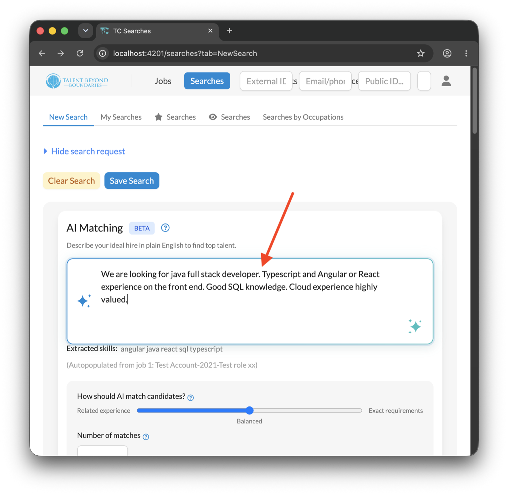
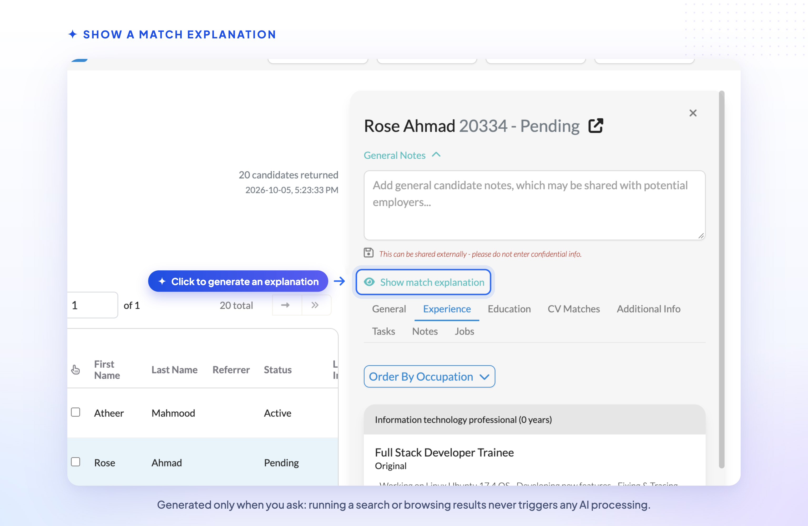
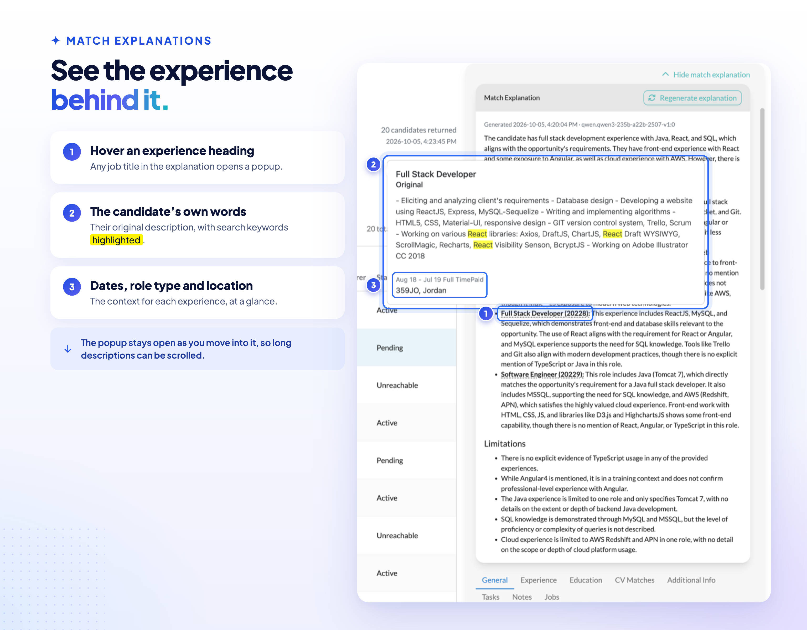
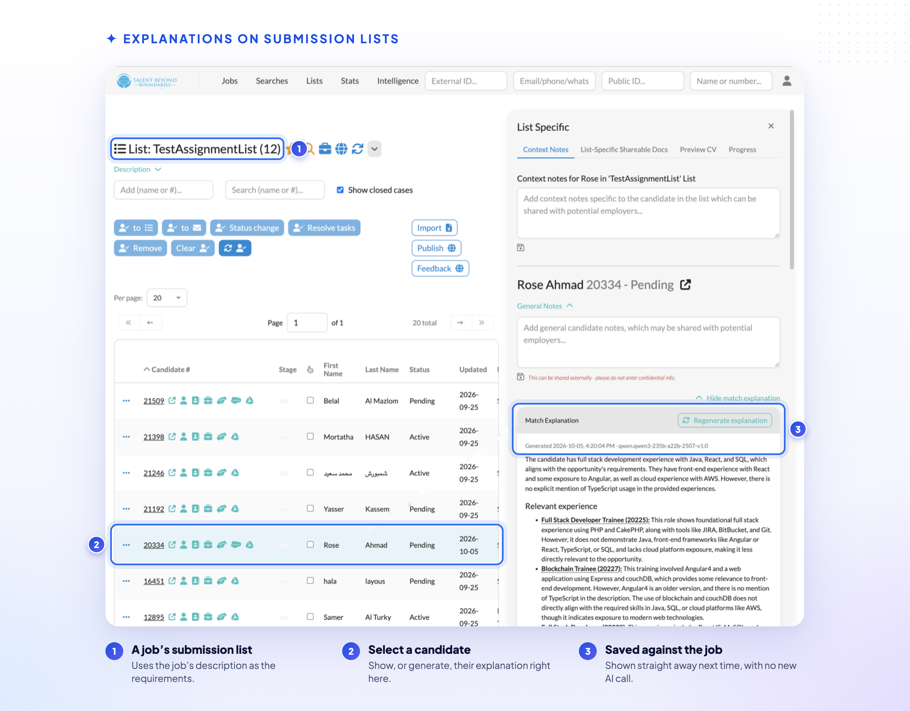

# Match Explanations: Why Was This Candidate Matched?

[v2.6.0](https://talent-catalog.github.io/talentcatalog/v260) brought AI matching online, ranking
candidates by how closely their experience fits a job description. It also promised that users
would be able to see *why* a candidate was matched, not just that they were.

This release delivers that. For any candidate in a matching search or a job's submission list,
Talent Catalog can now generate a plain-English explanation of how well the candidate's
experience fits the job — written by a large language model (LLM).

🎬 [Watch a short video on using AI matching](VIDEO_LINK_TBD)

---

## 📝 Start From the Requirements

Explanations compare a candidate against the **AI match requirements** text on the search screen.
That might be a job description pulled in from a job (as in the example above), or anything you
type yourself describing the experience you're looking for.

## 👁️ Show a Match Explanation

Select a candidate in the search results and click **Show match explanation**.

Explanations are only generated when you ask for one, so simply running a search or browsing
results never triggers any AI processing.

## 💡 What an Explanation Contains

Each explanation includes:

- **A summary** of how well the candidate matches overall.
- **Relevant experience** — a separate assessment of each of the candidate's job experiences,
  headed by that experience's job title.
- **Limitations** — what the candidate's experience doesn't show, or where the information is
  too thin to judge.

Explanations are dated, and show the name of the LLM that generated them (a Qwen model in this
case). Click **Regenerate explanation** to generate a fresh one — for example after the candidate
has updated their experience.

The LLM brings its general world knowledge to the comparison. In this example the candidate never
actually mentioned "cloud" experience, but she did mention AWS, and the LLM knew that AWS is a
cloud platform.

## 🔎 See the Experience Behind Each Explanation

Hover over any experience heading to see the candidate's own description of that experience,
including dates, role type and location, with search keywords highlighted. The popup stays open
while you move into it, so long descriptions can be scrolled.

## 📋 Explanations on Submission Lists

When a search is associated with a job, each candidate's explanation is saved against that job.
Next time anyone shows the explanation for that candidate and job — from a search or from the
job's submission list — the saved explanation is displayed straight away, with no new AI call.

New or updated explanations can also be generated directly from a job's submission list, using
the job's description as the requirements.

Searches that aren't associated with a job still show explanations, but these are generated on
request and not saved.

## ⚠️ A Word of Caution

Match explanations are generated by AI. They are a quick way to understand a candidate's fit,
but they can misread or overlook information. Use them as a guide alongside the candidate's
profile, not as a substitute for reviewing it.

## ⚙️ Under the Hood

- Explanations are generated by the Talent Catalog AI service, currently using the open-weight
  **Qwen3 235B** model. The cost is roughly 30 explanations per US cent.
- Only the requirements text and the candidate's job experience (job title and description) are
  sent to the LLM — not the candidate's name, contact details or other profile information.
- Saved explanations are stored per candidate and job, recording when they were generated and
  which model generated them. Regenerating an explanation replaces the saved one.
