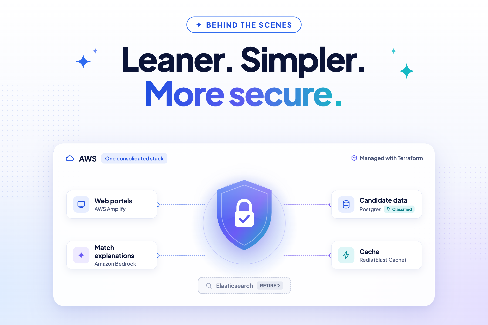

# A Leaner, More Secure Platform

    

This release includes a batch of work that won't change how Talent Catalog looks, but matters to
how safely and reliably it runs — correct access to candidate data, progress on our compliance
program, and infrastructure that's simpler and cheaper to run.

## 🔐 The Right Data for the Right Admins

Partner and role-based permissions now work as intended in candidate search and list results.
Admins from non-default partners were previously limited to only the most restricted,
publicly-visible view of a candidate's details — such as phone and email — in these results, even
when their partner and role entitled them to see more. They now see exactly what their partner and
role authorise, no more and no less.

## 🛡️ Security and Compliance with Vanta

We completed a compliance review with Vanta, our security and compliance monitoring platform, and
raised tickets to track any outstanding gaps as part of our ongoing Vanta Security and Compliance
Remediation project.

As part of that work, we've also created a **Data Inventory Map** in Vanta — a record of where
user data is held across the platform, with each resource classified by the kind of user data it
holds. Knowing exactly where user data lives, and how sensitive it is, matters for protecting that
data, for passing audits, and for giving our partners confidence in how we handle their
candidates' information. To support this map, our databases and test candidate data are now
tagged with data-classification labels directly in our infrastructure, so the map stays accurate
as infrastructure changes.

## 🔍 Elasticsearch Retired

Keyword search moved onto Postgres text search back in
[v2.4.0](../v240), after which Elasticsearch could be decommissioned, as noted in
[v2.5.1](../v251). This release finishes that job: Elasticsearch has now been fully removed from
our code, configuration, and infrastructure. Keyword search was already handled without it, so
this is a behind-the-scenes clean-up: no change for users, and lower hosting cost and complexity
for us.

## ☁️ Consolidating on OPC Infrastructure

We moved AWS Amplify to our OPC AWS account, set up Terraform support for Amazon Bedrock access to
power match explanations, and applied a batch of pending maintenance updates to our Redis
(ElastiCache) infrastructure.

## 🧪 Catching Regressions Earlier

Our deployment pipeline now runs its staging validation checks only after deployment has finished,
rather than as part of it — the first step of a broader Performance Regression Testing project
aimed at warning us automatically if a new release gets slower.

## 🚀 What's Next (v2.8.0)

- **Performance Regression Testing** — automatically warning the team if a new version gets
  slower.
- **GRN admin portal readiness** — preparing the admin portal for GRN's needs.
- **Continued Vanta remediation** — working through the gaps identified in this release's review.
- **OAuth login** for the candidate and admin portals via major identity providers.
- **Looser coupling between AI matching and jobs** — so matching works just as well without a job
  attached.

As with this release, expect more frequent, more targeted releases from the team going forward.
