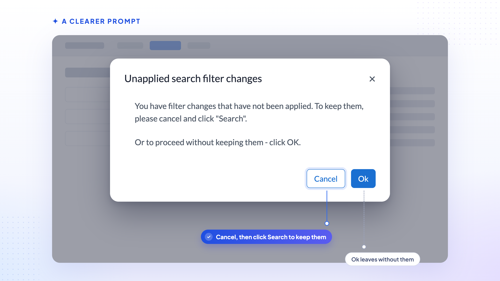

# Saved Searches That Keep Up

    

Submission lists and [full list filtering](../v260/other_highlights) made it easier to narrow down
candidates on the fly. This release makes saved searches themselves easier to work with, so the
filters you set are less likely to be lost or forgotten.

## 💾 Your Filters, Kept Automatically

Clicking **Search** on a saved search now automatically keeps any filter changes you've made on
that search — there's no longer a need to separately click **Update Search** just to stop those
changes being lost. This is the new standard behaviour for every saved search, and there's no
setting to turn it off.

If you've been using **Update Search** as a deliberate "commit" step — for example, to try out
filter changes without affecting the saved search until you're sure — be aware that running
**Search** now keeps those changes regardless.

## 💬 A Clearer Prompt

    

If you change a saved search's filters and then try to navigate away without clicking **Search**,
you'll now see a clearer prompt:

> **Unapplied search filter changes**
>
> You have filter changes that have not been applied. To keep them, please cancel and click
> "Search".
>
> Or to proceed without keeping them, click OK.

## 📊 Exports Match What You See

CSV export from a saved search now reflects the filters currently applied, including changes you
haven't explicitly saved — consistent with filters being kept automatically.

## 🏷️ Your Default Search, Properly Labelled

    

Your default search is now clearly headed **Unsaved**, instead of being shown under a
system-generated name such as "List: DefaultSearch-&lt;username&gt;".

## ⚡ Faster Save-to-List

Saving search results to a new list no longer times out for users with many saved lists. The
save-to-list dialog now requests lightweight list data instead of loading every saved list in
full.
