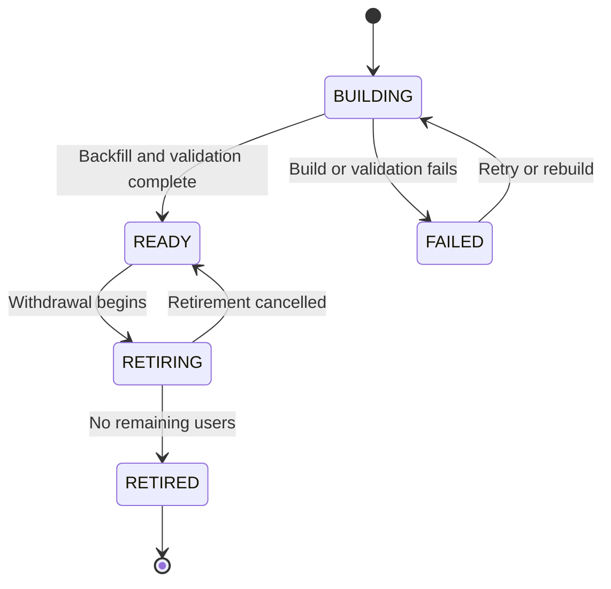

# Vector Embedding — Guide

This document provides an overview of how vector embedding is managed. 

                              
## Matching Candidates with Embeddings

The system uses vector embeddings to match candidates with job experiences.
   <!-- TODO: TBC -->

## Adding a New Embedding Model

   <!-- TODO: TBC -->
Every time you add a new embedding model, you need to add a new table and index.

You can have multiple embedding tables in the database - each associated with a different 
embedding model. 

Once a table is fully populated, it can become the table for matching.

## Retiring an Embedding Model

   <!-- TODO: TBC -->

## Embedding Model Lifecycle

