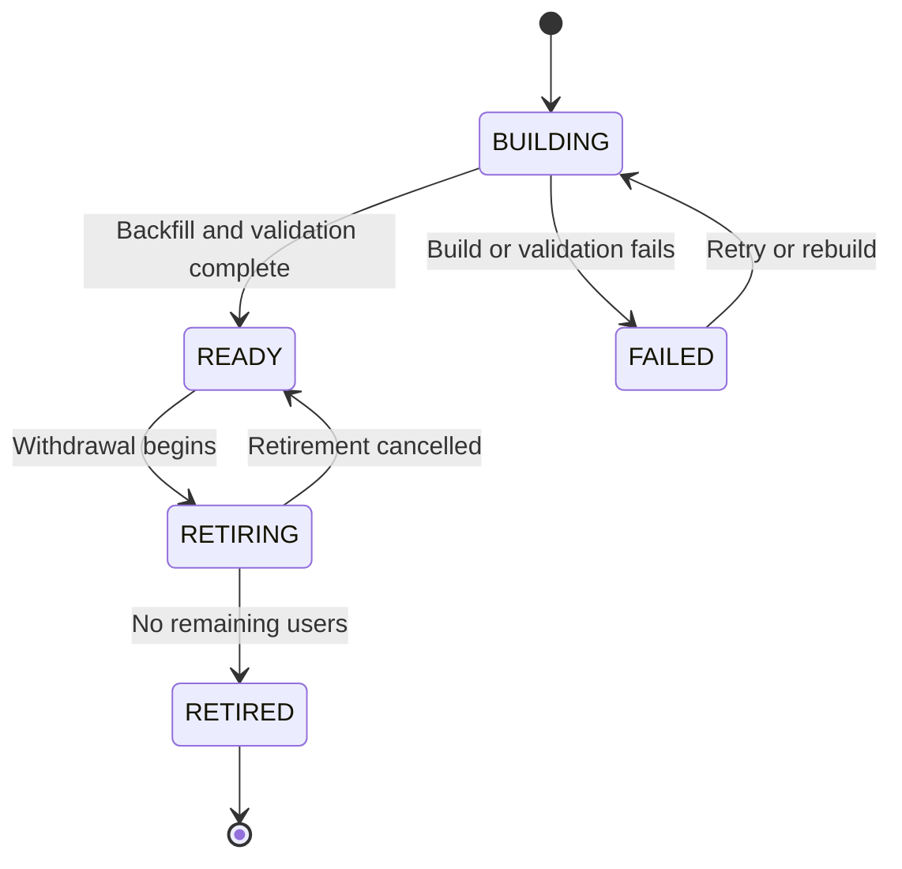

# Vector Embedding — Guide

This document provides an overview of how vector embedding is managed. 

                              
## Matching Candidates with Embeddings

The system uses vector embeddings to match candidates with job experiences.
   <!-- TODO: TBC -->

## Adding a New Embedding Model

You can have multiple embedding tables in the database: each associated with a different
embedding model.

Create a Flyway which adds a new record in the EmbeddingModel table for the new model.
That record should have its status set to BUILDING.

(You can reuse an existing embedding model record if one exists, for example, if the model has 
previously been used. You may then just need to update the record's status from RETIRED to BUILDING.)

In the Flyway, you should also create a new table which will hold the new embeddings.
The table's name should match the existing naming convention for embedding tables.

Then start the build process using the SystemAdminApi `build_embeddings` command.

Once a table is fully populated, the model's status will be set to READY, which will make it
visible to users so that they can select that model for matching.

You may want to make that new model the default model for matching. 
See the `defaultEmbeddingModelKey` property in the `application.yml` file.

## Restarting a failed build

The safest way to restart a failed model is to drop and then create the embedding table again. 
This will ensure that the table is empty and ready to be populated again.

Then change the model's status back to BUILDING (from FAILED), and restart the build process using
the SystemAdminApi `build_embeddings` command.

## Retiring an Embedding Model

When you want to retire an embedding model, change its status to RETIRING. 
This will prevent new users from selecting that model for matching, but existing users will still 
be able to use it until their browser session expires or they change to a different model.
Eventually, when you are sure that no users are using that model, you can change its status to 
RETIRED.
At that point, you can drop the model's embedding table from the database.

## Embedding Model Lifecycle

