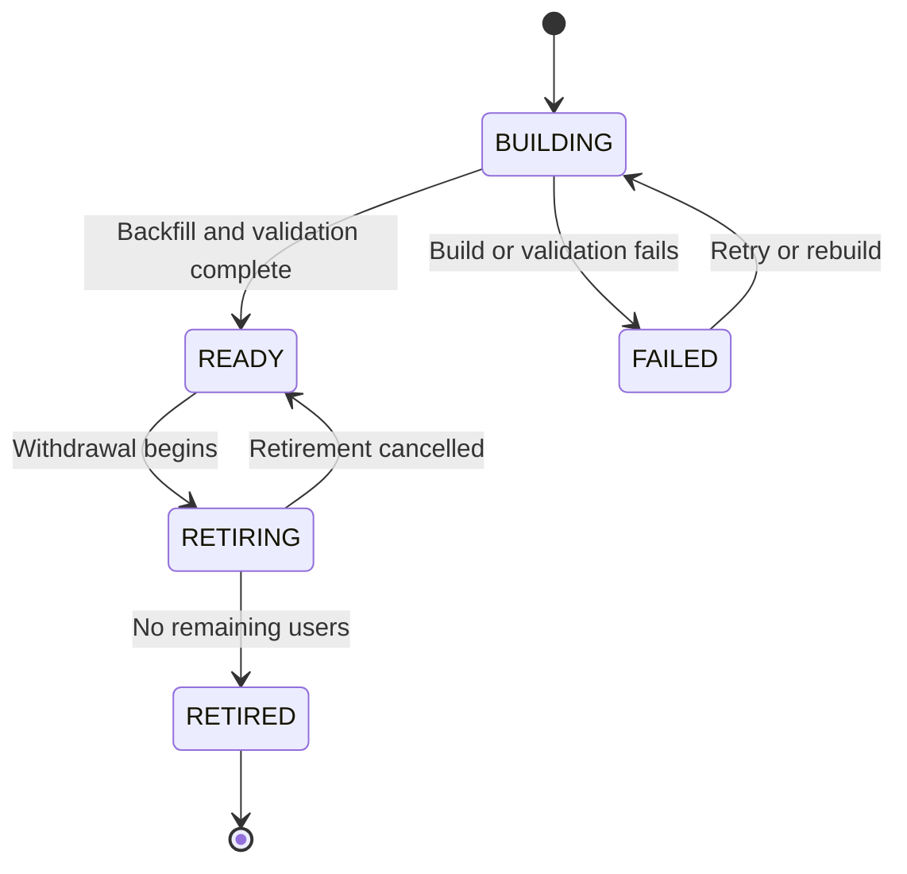

# Vector Embedding — Guide

This document provides an overview of how vector embedding is managed. 

                              
## Matching Candidates with Embeddings

The system uses vector embeddings to match a candidate's job experiences with a job description.

Each CandidateJobExperience can have one or more associated vector embeddings associated with it
Each vector embedding is associated with an EmbeddingModel.

Vector embeddings associated with an EmbeddingModel are stored in a separate table.
All vector embeddings in a table are associated with the same EmbeddingModel.

CandidateJobExperience's vector embeddings are stored in a table named as follows:
`experience_embedding_<embedding_model_key>`. 

See `EmbeddingModel.java` for a definition of "model key".
 
The matching generates two rankings:
- Lexical ranking: based on a text search for skills extracted from the job description in candidate
experiences
- Semantic ranking: based on the similarity of the candidate's experiences to the job description
as measured by the closeness of the vector embeddings.

Then the best candidates are selected by combining the two rankings based on a user-defined measure 
of the importance of each type of ranking. The default is that the two rankings are
of equal importance.

This logic is implemented in `CandidateBestNMatchingRepository.java`.

## Adding a New Embedding Model

You can have multiple embedding tables in the database: each associated with a different
embedding model.

First, you need to provide support for loading and using that new model in the Python embedding 
service.

Then create a Flyway which adds a new record in the EmbeddingModel table for the new model.
That record should have its status set to BUILDING.

(You can reuse an existing embedding model record if one exists, for example, if the model has 
previously been used. 
You may then just need to update the record's status from RETIRED to BUILDING.)

In the Flyway, you should also create a new table which will hold the new embeddings.
The table's name should match the existing naming convention for embedding tables.

Then start the build process using the SystemAdminApi `build_embeddings` command.

Once a table is fully populated, the model's status will be set to READY, which will make it
visible to users so that they can select that model for matching.

You may want to make that new model the default model for matching. 
See the `defaultEmbeddingModelKey` property in the `application.yml` file.

## Restarting a failed build

The safest way to restart a failed model is to delete all entries in the embedding table. 

Then change the model's status back to BUILDING (from FAILED), and restart the build process using
the SystemAdminApi `build_embeddings` command.

If the build didn't fail but just didn't complete because, for example, the executing server was 
restarted, you can just restart the build process using the SystemAdminApi `build_embeddings` 
command. The build will continue from where it got up to. It will not recreate embeddings that
are already present.

## Retiring an Embedding Model

When you want to retire an embedding model, change its status to RETIRING. 
This will prevent new users from selecting that model for matching, but existing users will still 
be able to use it until their browser session expires or they change to a different model.
Eventually, when you are sure that no users are using that model, you can change its status to 
RETIRED.
At that point, you can drop the model's embedding table from the database.

## Embedding Model Lifecycle

